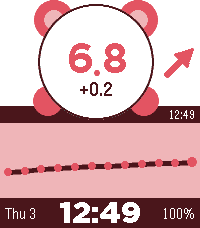
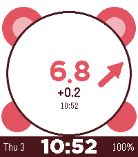

# CrimsonBear Cgm

<p align="center">
  
</p>

A crimson, pulse-line glucose watchface for Pebble Time 2 and newer hardware. It shows current glucose in a circle, bold solid-head trend arrows (including double arrows for rapid changes), delta, a 12-reading graph, date/time, and battery using the current Alloy embedded JavaScript runtime.

[Install CrimsonBear Cgm from the Pebble App Store](https://apps.rePebble.com/ebc3f63147e6481599da4b8e)

<table align="center">
  <tr>
    <th>Graph mode</th>
    <th>Full-screen mode</th>
  </tr>
  <tr>
    <td></td>
    <td></td>
  </tr>
</table>

On first launch, the watch displays a prominent setup notice directing the user to the watchface settings in the Pebble phone app.

## Supported watches

- Pebble Time 2 (`emery`, 200×228)
- Pebble Round 2 (`gabbro`, 260×260)

Older platforms are deliberately excluded. The layout uses the unobstructed screen size and adapts to rectangular and round displays.

## Data sources

- Nightscout: enter the site root URL and, for protected sites, an access token/API secret.
- mg/dL and mmol/L display modes, with configurable urgent-low, low, and high
  thresholds. Vibration alarms have independent low/high snooze intervals, alarm
  immediately when severity escalates, and can be disabled in settings.

Credentials remain in the Pebble phone companion's local storage and are sent only to the selected CGM service. This watchface is informational and must not be used to make treatment decisions.

## Quick build

You need Python 3, Node.js, [`uv`](https://docs.astral.sh/uv/), and a working ARM toolchain. Then run:

```sh
uv tool install pebble-tool
pebble sdk install latest
git clone git@github.com:dabear/CrimsonBearPebbleWatchFace.git
cd CrimsonBearPebbleWatchFace
npm install
pebble build
```

The finished package is written to `build/pebble.pbw`.

## Install

Enable Developer Connection in the Pebble phone app, then run:

```sh
pebble install build/pebble.pbw --phone
```

To build and install on the Time 2 emulator instead:

```sh
pebble install build/pebble.pbw --emulator emery
```

Open the watchface settings from the Pebble mobile app to configure a CGM source. The settings UI is bundled as a self-contained data URL, so it has no hosting dependency.

## Release

Run without arguments to choose build, phone installation, and publication
interactively:

```sh
PEBBLE_BIN="$(command -v pebble)" ./scripts/build-release.sh
```

Flags run non-interactively and can be combined. For example:

```sh
PEBBLE_BIN="$(command -v pebble)" ./scripts/build-release.sh --build --install
PEBBLE_BIN="$(command -v pebble)" ./scripts/build-release.sh --publish --release-notes "Release notes"
PEBBLE_BIN="$(command -v pebble)" ./scripts/build-release.sh --build --install --publish --release-notes "Release notes"
```

Build and publish actions install locked dependencies and run lint and formatting
checks. Publishing additionally requires a clean `main`, confirms it contains
`origin/main`, pushes the exact commit to GitHub, and publishes to the RePebble
store. Existing store screenshots are preserved. If release notes are omitted in
flag mode, the latest commit subject is used. `--publish` does not install on a
phone and does not require `--build`; the Pebble publisher performs its own required
package build before upload.

## Development notes

The watch code is in `src/embeddedjs/main.js`; phone networking and configuration are in `src/pkjs/index.js`. The watch requests a refresh at launch, the phone refreshes every five minutes, and the display calculates reading age locally every minute. Minute, battery, and duplicate-data updates use coalesced partial redraws to reduce display work and avoid overlapping Alloy output transactions.
